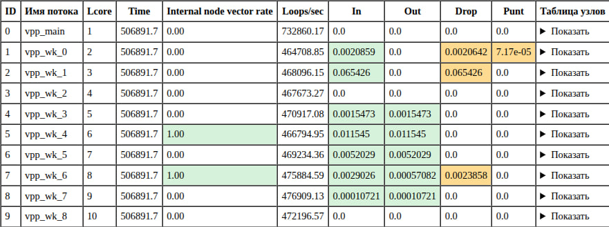

# eltex-cli-observer

Web tool for parsing and cleaning CLI output from Eltex devices.

## Supported modes

### VPP NGFW show runtime

Parses `show runtime` output and renders VPP thread and node statistics in a web interface.

### ESR CLI

Cleans ESR CLI output copied from a terminal or serial console session.

The parser removes trailing whitespace from each line. This helps normalize text copied from tools such as `minicom`, where selecting terminal output can include extra spaces at the end of lines.

Leading whitespace is preserved, so the configuration structure remains unchanged.